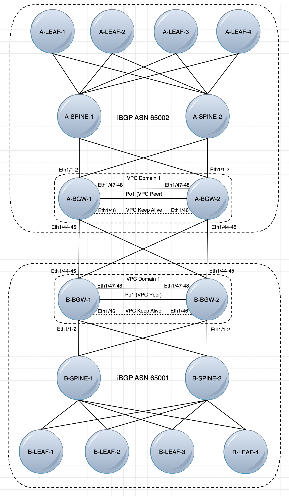
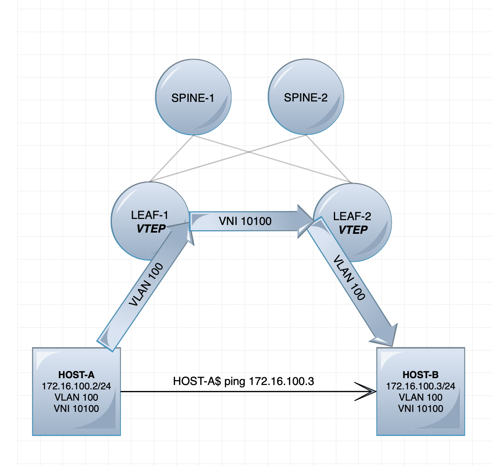
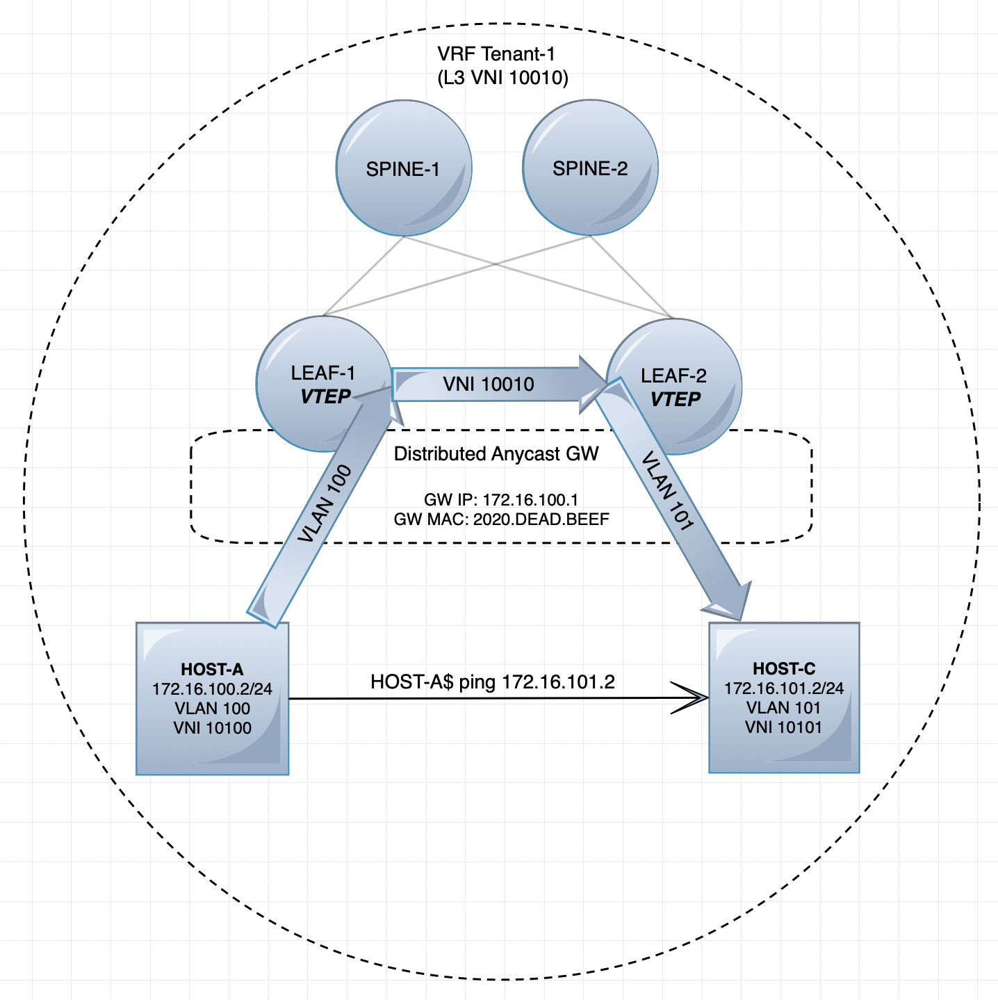
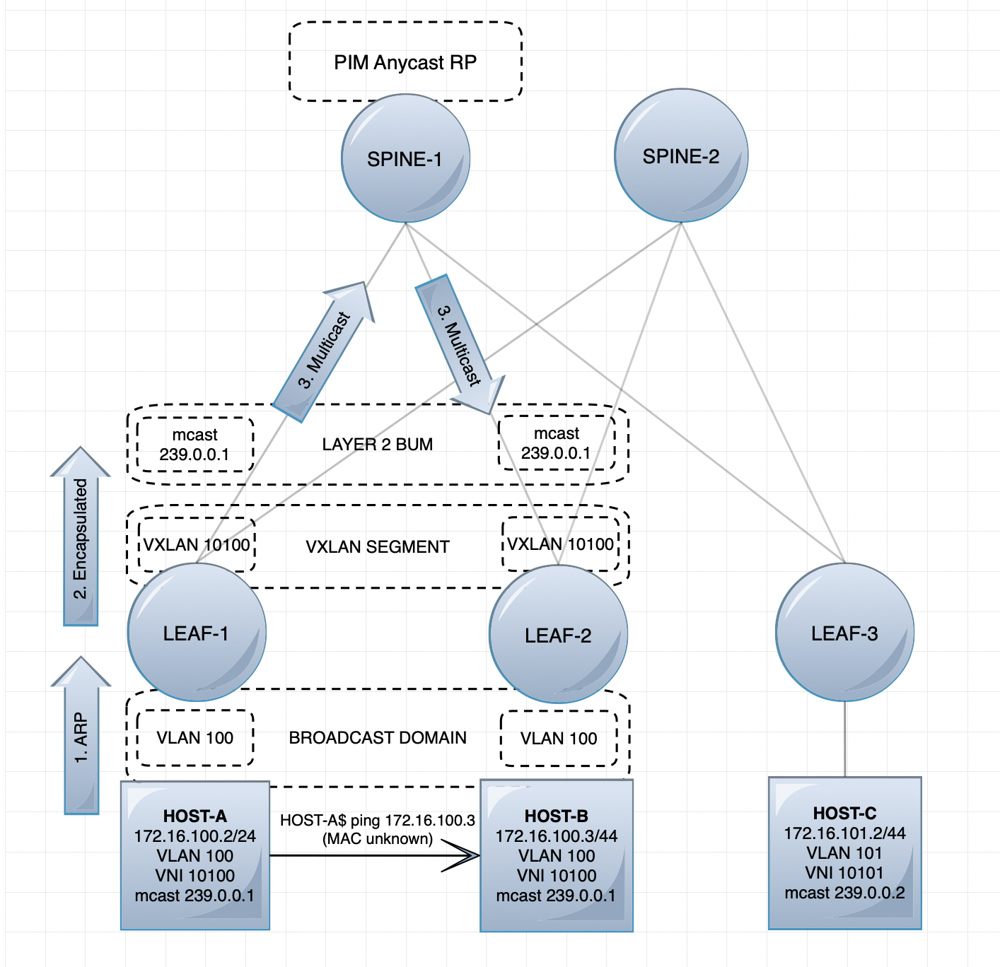

🏭 vxlan\_evpn\_fabric
======================

🪄 Configure VXLAN with EVPN controller in Cisco NXOS multisite clos-network.<br>
🧪 Tested on Cisco Nexus C93180YC-FX and C92348GC-X.

👇 **Underlay:**
- OSPF routing.
- P2P L3 links.
- ECMP.
- PIM Sparse with Anycast RP.

```YAML
+ - - - - - - - - - - - - - - - - - - - - - - - - - - - - - - - -
                         OSPF AREA 0.0.0.0                       |
|
         + - - - - - - - - - - - - - - - - - - - - - - - +       |
|
         |                PIM Anycast RP                 |       |
|                  Loopback254 10.254.254.254/32
         |                                               |       |
|        +--------------------+ - -+--------------------+
         |                    |    |                    |        |
|        |      SPINE-1       |    |      SPINE-2       |
         | RID: 10.250.250.30 |    | RID: 10.250.250.31 |        |
|        |                    |    |                    |
         +--------------------+    +--------------------+        |
|                   |                         |
                    |                         |                  |
|            +------+-------------------------+------+
             |              Loopback0 P2P            |           |
|            |                                       |
             |                                       |           |
| +--------------------+                  +--------------------+
  |                    |                  |                    | |
| |       LEAF-1       |                  |       LEAF-2       |
  | RID: 10.250.250.32 |                  | RID: 10.250.250.33 | |
| |                    |                  |                    |
  +--------------------+                  +--------------------+ |
+ - - - - - - - - - - - - - - - - - - - - - - - - - - - - - - - -
```

👇 **Overlay:**
- iBGP EVPN control plane.
- Multicast-replication (BUM).
```YAML
+ - - - - - - - - - - - - - - - - - - - - - - - - - - - - - - - -
                           BGP ASN 65001                         |
|
                                                                 |
|                       BGP Route Reflector
         +--------------------+    +--------------------+        |
|        |                    |    |                    |
         |      SPINE-1       |    |      SPINE-2       |        |
|        | RID: 10.250.250.30 |    | RID: 10.250.250.31 |
         |                    |    |                    |        |
|        +--------------------+    +--------------------+
                    |                         |                  |
|                   |                         |
             +------+-------------------------+------+           |
|            |                                       |
             |                                       |           |
|            |                                       |
  +--------------------+                  +--------------------+ |
| |                    |                  |                    |
  |       LEAF-1       |                  |       LEAF-2       | |
| | RID: 10.250.250.32 |                  | RID: 10.250.250.33 |
  |                    |                  |                    | |
| +--------------------+                  +--------------------+
           VTEP        |                           VTEP        | |
| |     Loopback1                         |     Loopback1
     10.254.250.32/32  |                     10.254.250.33/32  | |
| + - - - - - - - - - - - - - - - - - - - + - - - - - - - - - -
                   Distributed Anycast Gateway                 | |
| |           GW IP: 172.16.100.1 (SVI per VLAN/VNI)
                      GW MAC: 2020.DEAD.BEEF                   | |
| + - - - - - - - - - - - - - - - - - - - - - - - - - - - - - -
                                                                 |
+ - - - - - - - - - - - - - - - - - - - - - - - - - - - - - - - -
```

👇 **DCI:**
- Border-leafs in vPC.
- eBGP in DCI underlay and overlay.
- Ingress-replication (BUM).
- MACsec encryption (sites connected over dark-fiber).


👇 **L2 Host Segment:**
- No distributed anycast gateway.
- No VLAN SVI.
- No VRF.
- No ARP suppression.


👇 **L3 Host Segment:**
- Distributed anycast gateway.
- Multi-tenancy (VRFs).
- ARP suppression at leafs.


👇 **Broadcast, unknown Unicast and Multicast:**<br>
- Multisite BUM is always ingress replicate (unicast).


📚 **Resources:**
- [Cisco Nexus VXLAN configuration guide](https://www.cisco.com/c/en/us/td/docs/dcn/nx-os/nexus9000/101x/configuration/vxlan/cisco-nexus-9000-series-nx-os-vxlan-configuration-guide-release-101x/m_n9k_software_preface.html)<br>
- [Cisco VXLAN-EVPN Multi-Site Design and Deployment whitepaper](https://www.cisco.com/c/en/us/products/collateral/switches/nexus-9000-series-switches/white-paper-c11-739942.html#Introduction)<br>
- [Ansible documentation for Cisco Nexus](https://docs.ansible.com/ansible/latest/collections/cisco/nxos/index.html)<br>

Requirements
------------

💿 [Cisco NXOS Collection](https://galaxy.ansible.com/cisco/nxos) <br>

Role Variables
--------------

defaults/main.yml:
- pim\_anycast\_rp\_ip
- pim\_group\_range
- bgp\_neighbors
- dci\_macsec\_key
- vrfs
- host\_segments\_l3
- host\_segments\_l2

hostvars/[spine,leaf,border-leaf].yml:
- network\_function
- bgp\_asn
- rid\_ip

hostvars/[leaf,border-leaf].yml:
- vtep\_ip

hostvars/border-leaf.yml:
- vtep\_vpc\_vip
- nve\_infra\_ip
- dci\_vip
- dci\_interfaces
  - name
  - ip
  - bgp\_neighbor\_ip
  - bgp\_neighbor\_name
  - bgp\_remote\_asn

Dependencies
------------

💿 [cisco\_nxos\_vpc](https://galaxy.ansible.com/jiholland/cisco_nxos_vpc)

Example Playbook
----------------

    ---
    - name: Build VXLAN-EVPN fabric
      hosts: "{{ target }}"
      gather_facts: false

      roles:
        
        - role: cisco_nxos_vpc
          tags: vpc
          when: network_function == 'border-leaf'

        - role: vxlan_evpn_fabric
          tags: vxlan

License
-------

BSD

Author Information
------------------

Jørn Ivar Holland
